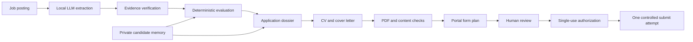

# BewerbungsPilot


[](https://github.com/Ventus652/BewerbungsPilot/actions/workflows/tests.yml)

BewerbungsPilot is a local, privacy-conscious assistant for preparing job applications. It reads a job posting, extracts its requirements, compares them with a verified candidate profile, prepares application documents and can fill supported application portals. Any external submission remains behind an explicit, one-time human approval.

The project started from a practical problem: preparing several good applications requires much more than copying the same CV and cover letter. Every offer has to be evaluated, the most relevant experience has to be selected, documents must remain factually correct, and form submissions must be recoverable without accidental duplicate clicks.

This repository contains the public pilot version. It uses fictional candidate data and synthetic job postings; private profiles, real applications, generated documents, browser sessions and operational logs are not part of the repository.

## What the pilot can do

- extract structured requirements from German or English job postings with a local Ollama model;
- verify extracted statements against the original posting;
- evaluate technologies, location, contract type, availability and working hours with deterministic rules;
- maintain a local evidence-based candidate memory with source priority and conflict detection;
- select relevant projects and prepare a targeted CV plan;
- generate and validate a one-page CV and cover letter from documented facts;
- fill a fictional portal or a supported Personio form with Playwright;
- stop before submission and require a single-use human authorization;
- record state transitions and prevent unsafe retries after an uncertain submission;
- provide a local dashboard for reviewing dossiers and controlling the workflow.

## Architecture



The language model is not trusted with final decisions. It extracts and proposes structured information; code verifies the evidence, applies the rules and controls state-changing actions.

## Safety model

BewerbungsPilot treats job applications as consequential external actions:

- facts must come from a documented source;
- unknown skills are never converted into experience;
- sensitive or legal questions can require human input;
- application data is isolated per employer;
- an authorization is bound to one application and one execution;
- the submission attempt is recorded before the click;
- after a network failure, the portal is inspected before any retry;
- real candidate data, generated dossiers and logs are ignored by Git.

See [Security and privacy](docs/SECURITY_AND_PRIVACY.md) for the public/private boundary.

## Current status

The pilot implements the complete path from offer extraction to a controlled portal submission. The Personio adapter has been exercised in a private real-world pilot, while the repository contains only synthetic fixtures and fictional profiles.

The next development milestone is a stronger application-strategy layer. Instead of selecting the closest previous CV, the system will construct a role-specific CV from verified modular facts and generate a more company-specific cover letter, followed by an independent quality review.

See the [roadmap](docs/ROADMAP.md) for the planned work.

## Quick start

### Requirements

- Python 3.12
- [Ollama](https://ollama.com/) for live local-model runs
- Playwright only for browser automation

### Installation

```powershell
git clone https://github.com/Ventus652/BewerbungsPilot.git
cd BewerbungsPilot
py -3.12 -m venv .venv
.\.venv\Scripts\python.exe -m pip install --upgrade pip
.\.venv\Scripts\python.exe -m pip install -e ".[dev]"
Copy-Item .env.example .env
```

For browser automation:

```powershell
.\.venv\Scripts\python.exe -m pip install -r requirements-browser.txt
.\.venv\Scripts\python.exe -m playwright install chromium
```

### Run the tests

```powershell
$env:PYTHONUTF8 = "1"
.\.venv\Scripts\python.exe -m pytest -q
```

### Run the fictional portal demo

```powershell
.\.venv\Scripts\python.exe scripts\demo_form.py
```

### Start the local dashboard

```powershell
.\.venv\Scripts\python.exe scripts\serve.py --open
```

The demo and test profile are fictional. Do not place real personal data in tracked files.

## Repository structure

```text
.
├── benchmarks/          # Synthetic extraction and evaluation cases
├── config/              # Example model and runtime configuration
├── docs/                # Architecture, privacy boundary and roadmap
├── scripts/             # Entry points for evaluation, documents and demos
├── src/bewerbungspilot/ # Application source code
├── templates/           # Public template directory
└── tests/               # Unit tests and fictional portal fixtures
```

## Design decisions

### Local models, deterministic controls

Local language models are useful for understanding varied job postings, but they are not reliable enough to decide whether a requirement is satisfied or whether an application may be sent. BewerbungsPilot therefore separates probabilistic interpretation from deterministic control.

### Evidence before prose

Candidate facts carry their source and validation date. Document generation receives a limited fact packet instead of the entire private profile. Unsupported claims are blocked before rendering.

### State instead of scripts

An application moves through explicit states such as `DISCOVERED`, `EVALUATED`, `SELECTED`, `DOCUMENTS_PREPARED`, `READY_TO_SUBMIT`, `SUBMITTED` and `CONFIRMED`. This makes interruption and recovery safer than a single long automation script.

## Limitations

- Portal layouts change and every adapter requires continued regression testing.
- The current document generator is deliberately conservative and still relies partly on previously validated CV structures.
- Local-model quality depends on the available hardware, model and prompt profile.
- Browser automation cannot remove CAPTCHA, authentication or legal-declaration requirements.
- This tool assists with applications; it does not guarantee an interview or employment outcome.

## Project status

This is an actively developed portfolio and research project. Interfaces and data models may change while the application-strategy and modular CV generation stages are being implemented.

## License

Released under the [MIT License](LICENSE).
